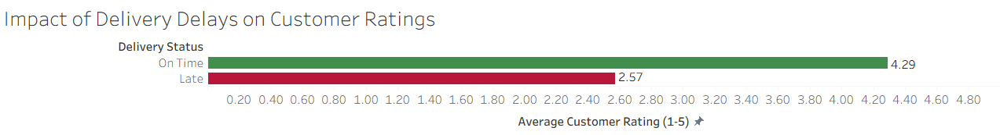
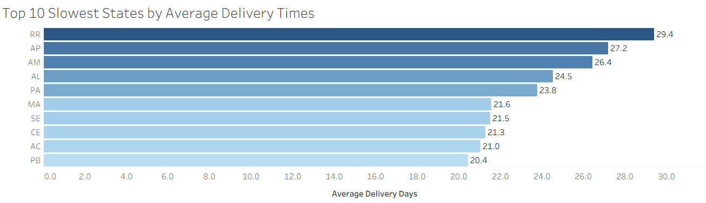
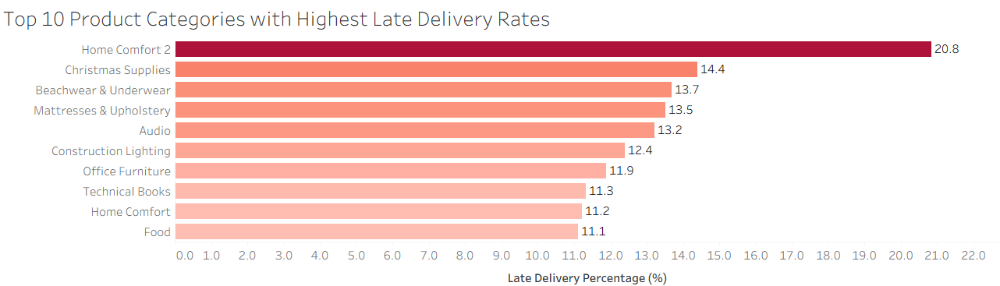
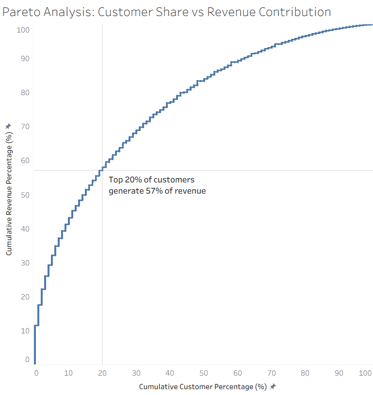
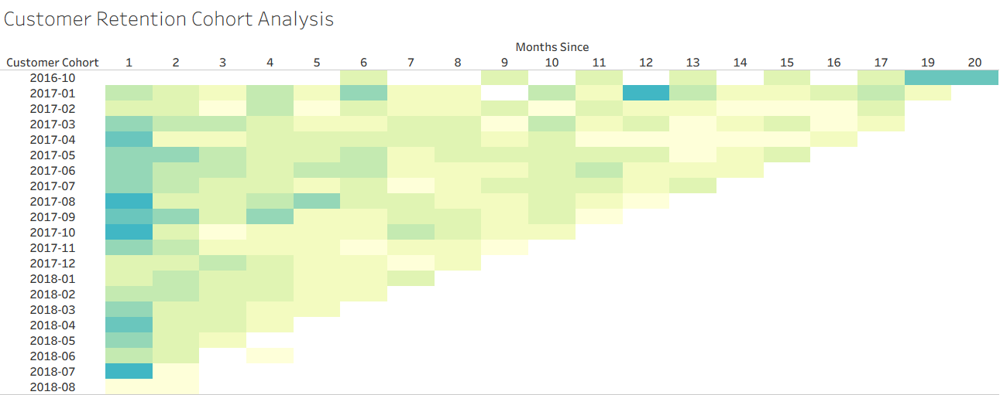
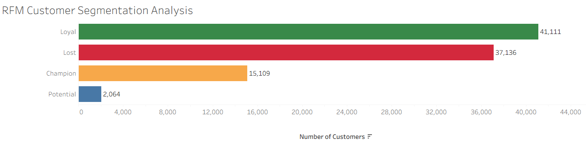

# What-Drives-Customer-Satisfaction-in-E-Commerce

## Project Overview

Customer satisfaction is one of the strongest drivers of long-term business success in e-commerce. Poor delivery experiences, declining retention, and customer churn can significantly impact revenue and brand reputation.

In this project, I analyzed the Brazilian Olist e-commerce dataset to identify the factors that influence customer satisfaction and business performance. Using SQL and Tableau, I explored delivery reliability, customer reviews, retention behavior, revenue concentration, and customer segmentation to uncover actionable insights that could help an e-commerce company improve customer experience and maximize customer lifetime value.


## Business Objectives

The Analysis was designed to answer the following business questions: 

### Customer Experience
* Do late deliveries negatively impact customer ratings?
* Which regions experience the longest delivery times?
* Which product categories are most vulnerable to delivery delays?

### Revenue Growth
* How concentrated is revenue among customers?
* Are a small number of customers driving a large share of sales?

### Customer Retention
* How effectively does the business retain customers over time?
* At what point do customers stop returning?

### Customer Segmentation
* Which customer groups are most valuable?
* Which customers are at risk of being lost?
* Where should marketing and retention efforts be focused?

## Dataset

This project uses the public Brazilian E-Commerce dataset provided by Olist.

The dataset contains:
- 100,000+ orders
- Customer information
- Product categories
- Delivery timestamps
- Customer reviews
- Payment data

Source:
https://www.kaggle.com/datasets/olistbr/brazilian-ecommerce


## Tools Used

- SQL (SQLite) – data cleaning, transformation, and business analysis
- Tableau – data visualization and dashboard development
- Git & GitHub – version control and project documentation

## Hypothesis-Driven Analysis

To complement exploratory analysis, a series of business hypotheses were investigated using SQL. This approach mirrors how business analysts translate stakeholder assumptions into data-driven insights.

| Business Hypothesis                                                | Result    |
| ------------------------------------------------------------------ | --------- |
| Late deliveries reduce customer ratings                            | Supported |
| Delivery performance varies significantly by state                 | Supported |
| Certain product categories experience higher delay rates           | Supported |
| Revenue is concentrated among a relatively small customer segment  | Supported |
| Customer retention declines significantly after the first purchase | Supported |
| Customer value differs across customer segments                    | Supported |
| RFM segmentation can identify high-value and at-risk customers     | Supported |

These hypotheses were validated through SQL analysis and subsequently visualized in Tableau to generate actionable business recommendations.


## Executive Summary 

The analysis revealed several important business insights: 

✅ Customers who receive late deliveries leave significantly lower ratings than customers whose orders arrive on time.

✅ Delivery performance varies considerably across Brazilian states, suggesting regional logistics challenges.

✅ Certain product categories experience disproportionately high late-delivery rates.

✅ The top 20% of customers generate approximately 57% of total revenue, highlighting the importance of customer retention.

✅ Customer retention declines sharply after the first few months following a purchase.

✅ A large proportion of customers fall into either Loyal or Lost segments, creating opportunities for both retention and reactivation strategies.

## Key Findings

### Impact of Delivery Delays on Customer Ratings


#### Key Finding

Customers whose orders were delivered on time gave an average rating of 4.29, while customers who experienced late deliveries gave an average rating of only 2.57.

#### Business Insight

Delivery reliability has a direct impact on customer satisfaction. Late deliveries significantly increase the risk of negative reviews, which can damage brand reputation and reduce customer loyalty. Improving logistics performance could lead to higher customer satisfaction and stronger long-term retention.

### Top 10 Slowest States by Average Delivery Time


#### Key Finding

States such as Roraima (RR), Amapá (AP), and Amazonas (AM) recorded the highest average delivery times, with deliveries taking over 26 days on average.

#### Business Insight

Geographic location plays a significant role in delivery performance. Identifying regions with consistently long delivery times allows the business to optimize logistics networks, improve shipping partnerships, and better manage customer expectations in affected areas.

### Product Categories with Highest Late Delivery Rates


#### Key Finding

Home Comfort 2, Christmas Supplies, and Beachwear & Underwear experienced the highest proportions of late deliveries, with delay rates reaching over 20% in some categories.

#### Business Insight

Certain product categories are more vulnerable to fulfillment and shipping challenges than others. Understanding which categories are most affected enables the business to improve inventory planning, supplier coordination, and shipping processes to reduce delays and improve customer experience.

### Pareto Analysis


Top 20% of customers generate approximately 57% of revenue.

#### Key Finding

The top 20% of customers generate approximately 57% of total revenue, demonstrating a strong concentration of revenue among a relatively small segment of the customer base.

#### Business Insight

High-value customers represent a critical source of revenue. Investing in loyalty programs, personalized offers, and premium customer experiences for these customers could generate significant returns and improve overall customer lifetime value.

### Customer Retention Cohort Analysis


#### Key Finding

Customer retention declines rapidly after the first few months following an initial purchase. Most cohorts exhibit lower retention rates as time progresses.

#### Business Insight

While customer acquisition appears successful, retaining customers remains a challenge. The business could benefit from post-purchase engagement strategies, loyalty incentives, and targeted marketing campaigns designed to encourage repeat purchases and reduce customer churn.

### RFM Customer Segmentation


#### Key Finding

The largest customer segments are Loyal (41,111 customers) and Lost (37,136 customers), while Champion customers represent a smaller but highly valuable segment.

#### Business Insight

Different customer groups require different engagement strategies. Loyal and Champion customers should be prioritized for retention and reward programs, while Lost customers represent an opportunity for reactivation campaigns. A targeted segmentation strategy can improve marketing efficiency and maximize customer lifetime value.

## Business Recommendations

### 1. Improve Delivery Performance

Reduce delivery delays through logistics optimization, particularly in high-delay states and product categories.

### 2. Prioritize High-Value Customers

Develop loyalty programs and personalized experiences for customers who contribute the largest share of revenue.

### 3. Strengthen Customer Retention

Implement post-purchase engagement initiatives to encourage repeat purchases and improve long-term retention rates.

### 4. Re-engage Lost Customers

Use targeted promotions and win-back campaigns to reactivate previously active customers.

### 5. Leverage Customer Segmentation

Apply RFM segmentation to tailor marketing efforts, allocate resources more effectively, and improve customer lifetime value.

## Repository Structure

```py 
What-Drives-Customer-Satisfaction-in-E-Commerce/
│
├── README.md
│
├── sql/
│   ├── 01_revenue_analysis.sql
│   ├── 02_customer_analysis.sql
│   ├── 03_seller_analysis.sql
│   ├── 04_delivery_analysis.sql
│   ├── 05_customer_satisfaction.sql
│   ├── 06_advanced_analytics.sql
│   └── 07_business_hypothesis_validation.sql
│
├── data/
│   ├── 01_late_delivery_ratings.csv
│   ├── 02_state_delivery_days.csv
│   ├── 03_category_late_delivery.csv
│   ├── 04_pareto_analysis.csv
│   ├── 05_cohort_retention.csv
│   └── 06_rfm_segments.csv
│
├── tableau/
│   ├── olist_dashboard.twb
│   │
│   └── screenshots/
│       ├── 01_delivery_ratings.png
│       ├── 02_slowest_states.png
│       ├── 03_category_delays.png
│       ├── 04_pareto_analysis.png
│       ├── 05_cohort_retention.png
│       └── 06_rfm_segments.png
│
└── project.sqbpro
```